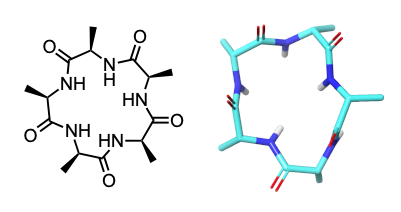

# 🧪 3D PSA → Permeability → Web Portal

Permeability is critical for large or beyond‐Lipinski compounds (macrocycles, peptides, PROTACs).  Their high polarity and size often hinder passive cellular uptake.

This project demonstrates a **fast 3D PSA calculation** + **machine‐learning MDCK permeability model**, culminating in a **chemist‐friendly prediction script** or Flask web portal.

---

## 📂 File Structure & Folders

```
ml-web-portal/
├── data/                   # Example input files
│   ├── penta_ala.smi       # SMILES for cyclic penta‑alanine
│   └── cycpep_training.csv # 40‑compound training set (SMILES, MDCK, 3D PSA)
│
├── outputs/                # Generated results and models
│   ├── penta_ala.sdf       # Lowest‑energy conformer 3D SDF (gen_conf.py)
│   ├── mdck_model.pkl      # Trained Random Forest model (train_model.py)
│   └── penta_ala_pred.csv  # Predicted MDCK values (predict_mdck.py)
│
├── src/                    # Python scripts for the workflow
│   ├── gen_conf.py         # Generate 3D conformers from SMILES
│   ├── utils_sasa.py       # Compute 3D PSA via FreeSASA on 3D SDF
│   ├── train_model.py      # Train RF regression on MDCK Papp
│   └── predict_mdck.py     # Predict MDCK Papp on new 3D SDF
│
└── environment.yml         # Conda environment with RDKit, FreeSASA, sklearn, etc.
```

---

## 🚀 Quick Tutorial: SMILES → MDCK Prediction

Below is a step‑by‑step guide to run the full pipeline on **penta‑ala**.

1. **Create a Conda environment**

   ```bash
   ```

python src/predict\_mdck.py 
\--model outputs/mdck\_model.pkl 
\--input-sdf outputs/penta\_ala.sdf 
\--output-csv outputs/penta\_ala\_pred.csv

````

   **Example output:**
   ```text
     Name  Predicted_MDCK
penta_ala       -5.250217
````

> **Note:** MDCK Papp values are reported in **log scale**. A log Papp (A→B) of –5 corresponds to 10⁻⁵ cm/s, indicating moderate cell permeability—sufficient for passive diffusion but possibly needing optimization for intracellular targets.

```

   - Loads your 3D SDF, recomputes PSA + descriptors
   - Outputs predicted MDCK Papp values to CSV

---

## 🧪 Toy System Example: cyclic penta‑alanine

<p align="center">
  
</p>

SMILES (head‐to‐tail cyclized Ala₅):

```

O=C1[C@H](NC%28[C@H]%28NC%28[C@H]%28NC%28[C@H]%28NC%28[C@H]%28N1%29C%29=O%29C%29=O%29C%29=O%29C%29=O)C

```

This drives the steps above and yields a predicted MDCK log Papp.

---

## 📈 Model Details & Performance

- **Model:** Random Forest regressor with hyperparameter grid over `n_estimators=[50,100]`, `max_depth=[5,10]` via 5‑fold CV.
- **Features:** 3D PSA (FreeSASA), MolWt, LogP, TPSA, H‑bond donors/acceptors, rotatable bonds, heavy atom count, aromatic ring count, formal charge.
- **Performance:** Achieves CV R² ≈ 0.41 and MAE ≈ 0.44 log units on the 40‑compound training set.

> Note: With only 40 samples, the model is proof‑of‑concept. Expanding the dataset or exploring gradient boosting and kernel methods can further improve accuracy.

---

## 📚 References

- Möbitz H. “Design Principles for Balancing Lipophilicity and Permeability in beyond Rule‑of‑5 Space.” *ChemMedChem* **2023**, 18, e202300395.
- Lawrenz M. et al. “A Computational Physics‑based Approach to Predict Unbound Brain‑to‑Plasma Partition Coefficient, Kp,uu.” *J. Chem. Inf. Model.* **2023**, 63(12), 3786–3798.

```

